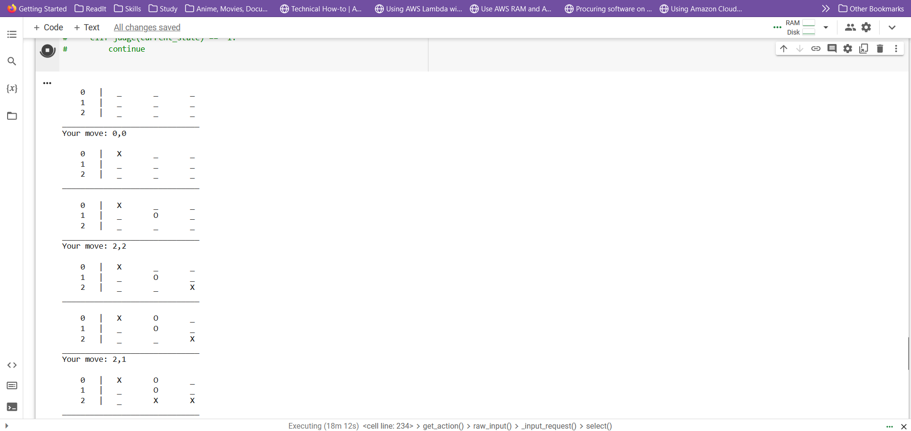

# Tic Tac Toe Game with Monte Carlo Tree Search AI 🎮🤖

Welcome to the Tic Tac Toe game with an AI opponent powered by the Monte Carlo Tree Search (MCTS) algorithm! Enjoy a classic game of Tic Tac Toe against an AI that uses advanced strategies to challenge you.

## How to Play 🕹️
1. Run the script using your favorite Python interpreter.
2. When prompted, enter your move using the format row,column. For example, `0,1` represents the top-center cell.
3. The AI will take its turn using the powerful MCTS algorithm.
4. The game board will be displayed after each move so you can follow along.
5. The game ends when there's a winner, a tie, or someone quits.

## Game Features 🎉
- Choose whether you or the AI goes first for added variety.
- Experience the thrill of playing against an AI that adapts its strategy using MCTS.
- The game state is shown after every move for easy tracking.
- The AI evaluates multiple simulated games to make smart decisions.
- Enjoy a challenging gameplay experience that evolves as you play.

## AI Strategy 🤯
- The AI seeks winning moves and blocks your potential victories.
- It explores various moves to anticipate the best possible outcome.
- The AI's strategy is dynamic and reacts to the current game state.

## Example Gameplay 🎲
Here's a glimpse of what a game might look like:

Feel free to run the script and enjoy a game against the AI. Have fun and relive the excitement of Tic Tac Toe with a smart twist!

## Contribution 🤝
You're welcome to modify, contribute, or learn from the code. Let's make Tic Tac Toe even more interesting! 🚀

Enjoy the game and may the best strategist win! 🎉🤖
